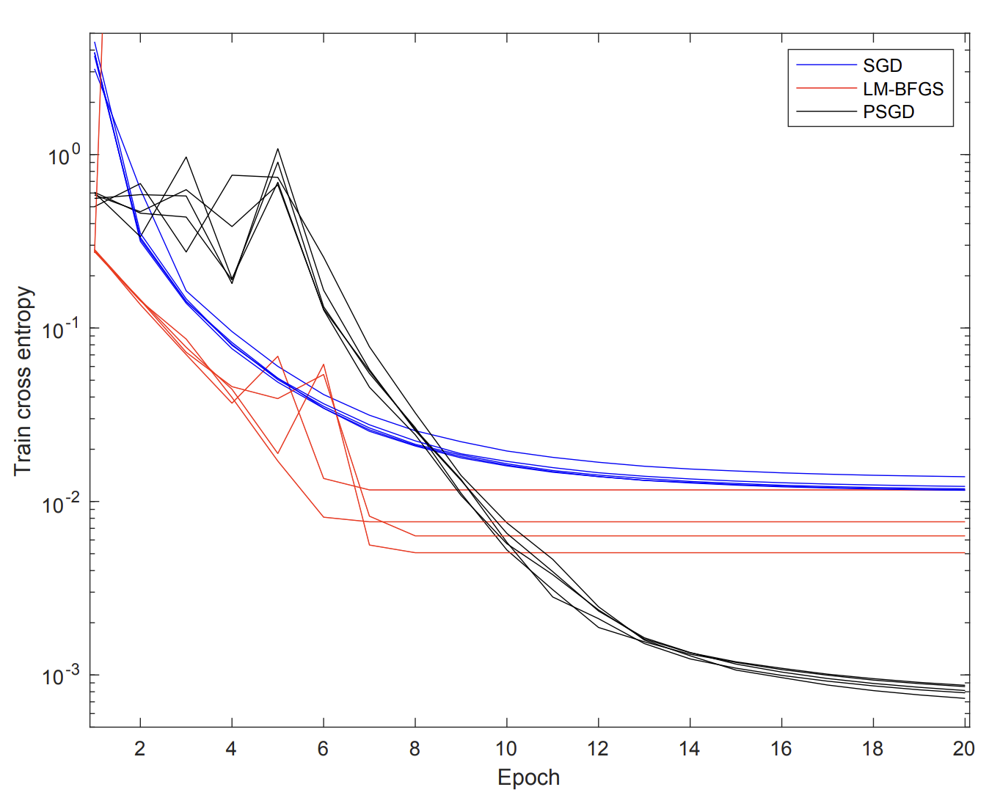
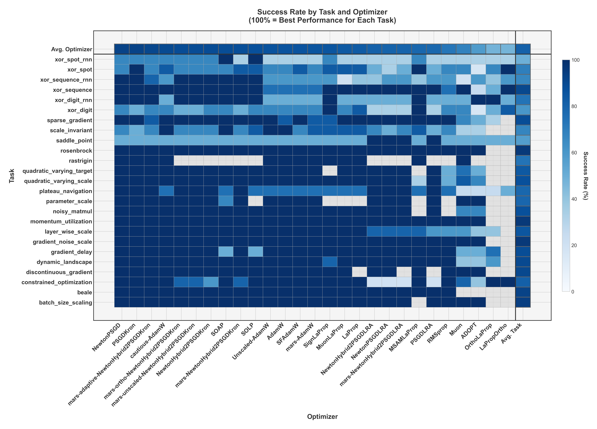
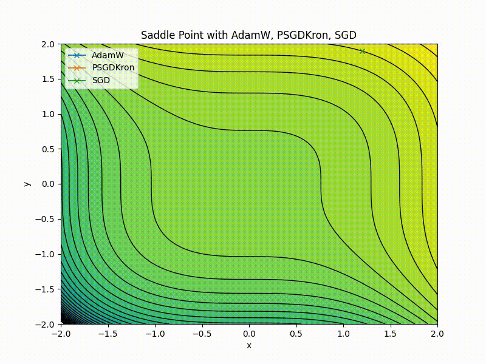

# Diagnostic Benchmark

Optimizers can converge without error yet settle in a suboptimal basin. The loss curve flattens, the logs show no
errors, and the problem only surfaces in downstream evaluation. Without a comparison point, there is no signal that
anything went wrong.

*Figure 3 from ["Black Box Lie Group Preconditioners for SGD"](https://arxiv.org/abs/2211.04422). SGD (blue) appears
converged, but PSGD (black) finds a basin an order of magnitude better on this problem.*

The HeavyBall Benchmark is a diagnostic tool: over 150 pass/fail tests targeting known optimization challenges.
For optimizer selection guidance, see [Choosing an Optimizer](optimizer_guide.md).

## Setup

Each optimizer gets 1,000 hyperparameter trials per task, with each trial running for up to 100,000 steps. This tests
raw capability, not default settings. The `Attempts` column is the average number of trials needed for success.

## Results

*Rows are task categories, columns are optimizers. Color intensity reflects rank-normalized success rate within each category.*

| Optimizer | Cautious | Mars | Success | Attempts | Avg Runtime (s) |
|:---|:---|:---|:---|:---|:---|
| CachedPSGDKron | No | No | 77.0% | 73.2 | 8240 |
| NewtonPSGDKron | No | No | 77.0% | 80.5 | 9052 |
| AdamW | Yes | No | 75.7% | 61.2 | 8072 |
| ForeachSOAP | No | No | 72.5% | 77.9 | 7827 |
| AdamW | No | No | 72.3% | 107.8 | 10029 |
| MuonLaProp | No | No | 68.2% | 82.7 | 10141 |
| RMSprop | No | No | 55.6% | 114.4 | 10725 |
| Muon | No | No | 51.0% | 129.1 | 14525 |

*Subset of results.
[Full breakdown](https://github.com/HomebrewML/LightBench/blob/master/lightbench/benchmark_results.md).*

### AdamW with Caution

Enabling `caution=True` on AdamW improves both success rate and tunability. The Cautious variant avoids basins that the
standard variant gets stuck in.

### Saddle Points

A saddle point (a minimum in one direction, a maximum in another) traps first-order methods whose gradients vanish at
the center.

---

* **Full Results:** [benchmark_results.md](https://github.com/HomebrewML/LightBench/blob/master/lightbench/benchmark_results.md)
* **Benchmark Code:** [github.com/HomebrewML/LightBench](https://github.com/HomebrewML/LightBench)
