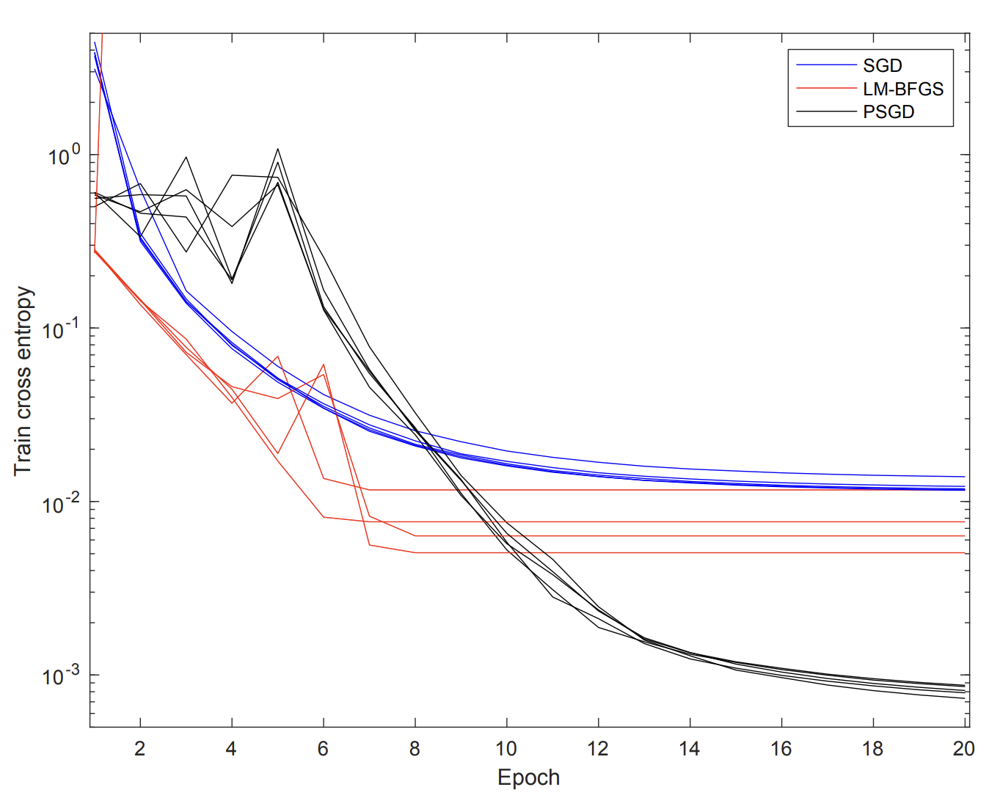
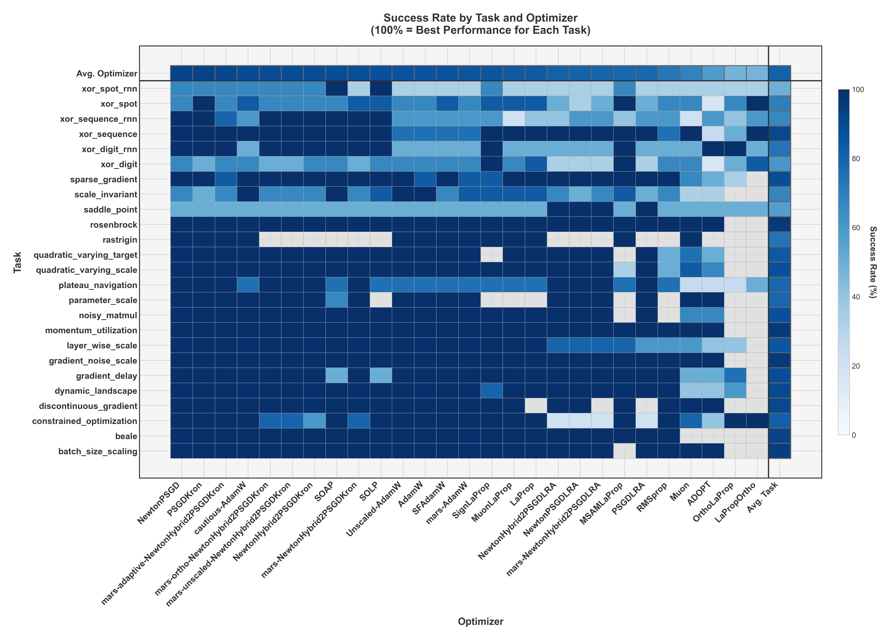
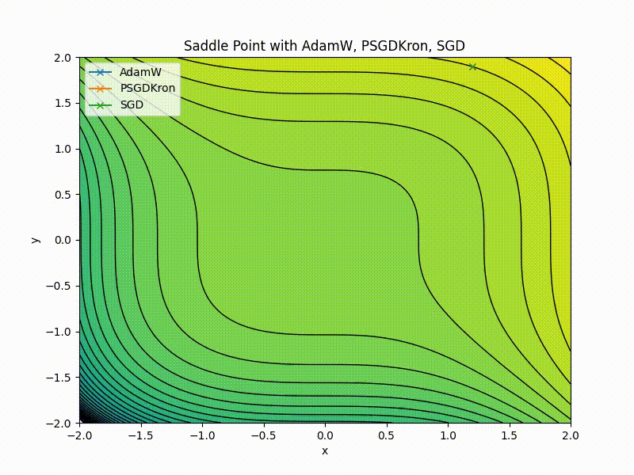

# Beyond the Leaderboard: A Diagnostic Benchmark for Optimizer Reliability

Traditional machine learning benchmarks often incentivize "teaching to the test," a race to top leaderboards that may
not reflect real-world performance. This practice can mask a critical issue: **silent failures**. Optimizers may
converge without reporting an error, yet settle in a suboptimal solution, leading to models that underperform in subtle
but significant ways. Such failures are costly, as they often go undetected until significant downstream damage has occurred.

The HeavyBall Benchmark was created to address this problem. It's not another leaderboard but a diagnostic tool
designed to expose hidden optimizer weaknesses. Each test provides a clear, pass/fail check against known optimization
challenges, creating a detailed map of an optimizer's strengths and weaknesses.

## The Problem of Silent Failures

A silent failure occurs when an optimizer converges without error yet settles in a suboptimal basin, leading to poor
downstream model performance. A descending loss curve can be profoundly misleading. Without a clear point of comparison,
an optimizer that has simply gotten stuck can appear identical to one that has found a genuinely good solution.

*Figure 3 from ["Black Box Lie Group Preconditioners for SGD"](https://arxiv.org/abs/2211.04422). As shown, SGD (blue)
appears converged, but PSGD (black) finds a significantly better basin. This highlights a fundamental capability gap.*

The graph above illustrates this trap. All three optimizers seem to converge as their loss curves flatten. An
unsuspecting practitioner might see the flatlining loss of the blue curve (SGD) and conclude the job is done. Yet, the
black curve (PSGD) consistently finds a solution that is an order of magnitude better. This isn't a matter of an unlucky
random seed; it's a capability gap. No amount of rerunning SGD will find the better solution that PSGD locates with
ease.

This capability gap often goes unnoticed. The training logs provide no explicit error, leaving developers to discover
the underperformance only through expensive downstream evaluation.

## The HeavyBall Diagnostic Benchmark

Instead of a single score, the HeavyBall Benchmark provides a granular, diagnostic map of an optimizer's performance.
It's built on a suite of over 150 independent, pass/fail tests, each targeting a specific, well-understood challenge
known to cause hidden failures.

*This map reveals systemic strengths and weaknesses in popular optimizers. Each cell represents a pass/fail outcome for
a solver (column) on a specific task (row). Darker blue indicates a higher success rate.*

There is no partial credit; the optimizer either solves the problem or it does not. This binary outcome makes failure
modes explicit, turning abstract weaknesses into concrete, observable data.

### Experimental Setup

To ensure a fair comparison, we gave each optimizer a generous budget: 1,000 hyperparameter trials per task, with each
trial running for up to 1,000,000 steps. This setup tests the optimizer's raw capability, not just its default settings.
The `Attempts` column in our results reflects the average number of trials needed for success; a lower number indicates
that the method is easier to tune for the problems it can solve.

## Benchmark Results: No Single Best Optimizer

Our results show that no single optimizer dominates. Even the best-performing optimizers exhibit surprising weaknesses,
reinforcing the need for diagnostic rather than purely comparative evaluation.

| Optimizer      | Cautious¹ | Mars² | Success | Attempts | Avg Runtime (s) |
|:---------------|:----------|:------|:--------|:---------|:----------------|
| PSGDKron       | No        | No    | 77.0%   | 73.2     | 8240            |
| NewtonPSGDKron | No        | No    | 77.0%   | 80.5     | 9052            |
| AdamW          | Yes       | No    | 75.7%   | 61.2     | 8072            |
| ForeachSOAP    | No        | No    | 72.5%   | 77.9     | 7827            |
| AdamW          | No        | No    | 72.3%   | 107.8    | 10029           |
| MuonLaProp     | No        | No    | 68.2%   | 82.7     | 10141           |
| RMSprop        | No        | No    | 55.6%   | 114.4    | 10725           |
| Muon           | No        | No    | 51.0%   | 129.1    | 14525           |

<small>¹ `Cautious`: Avoids taking a step in a direction the current gradient does not agree with</small>
 
<small>² `Mars`: Reduces variance in gradients</small>

*This is a subset of the full results. For a complete breakdown, see
the [full benchmark results](https://github.com/HomebrewML/LightBench/blob/master/lightbench/benchmark_results.md).*

### Case Study: The `AdamW` Family

The results for the popular AdamW optimizer are particularly revealing. The standard implementation has a respectable
72.3% success rate. However, enabling the `Cautious` flag boosts the success rate to 75.7% and significantly reduces the
number of attempts needed to find a solution. This isn't just a number; it's a diagnostic signal. The standard `AdamW`
is more prone to getting stuck in ways that its `Cautious` variant can avoid, allowing a practitioner to make a more
informed choice.

### Case Study: Escaping the Saddle Point

An optimizer’s inability to navigate a saddle point is a classic example of a silent failure. A key test of an
optimizer's robustness is its ability to navigate a saddle point—a region that is a minimum in one direction but a
maximum in another. The gradient approaches zero at the center, trapping first-order methods that rely solely on the
gradient.

Our benchmark includes a specific test for this challenge. An optimizer that passes demonstrates a greater capacity to
handle the complex non-convex landscapes common in deep learning. A failure provides a clear diagnostic signal that the
optimizer may be unreliable in these settings.

## Conclusion

The HeavyBall Benchmark represents a necessary shift in how we evaluate optimizers, moving from a culture of
score-chasing to one of deep, diagnostic understanding. These hidden failures aren’t rare edge cases—they’re a routine
source of wasted compute and disappointing models. By making them explicit, the benchmark equips researchers and
practitioners with a detailed map of an optimizer's capabilities. By clearly identifying hidden failure modes,
practitioners can confidently choose, tune, or reconsider their optimization strategies, ultimately leading to more
robust and reliable models. Future work will focus on expanding our suite of diagnostic tests to cover more complex
failure modes and developing novel visualization techniques.

---

**Resources:**

* **Full Results:** [LightBench/src/lightbench/benchmark_results.md](https://github.com/HomebrewML/HeavyBall/blob/main/LightBench/src/lightbench/benchmark_results.md)
* **Benchmark Code:** [https://github.com/HomebrewML/HeavyBall/tree/main/LightBench](https://github.com/HomebrewML/HeavyBall/tree/main/LightBench)
